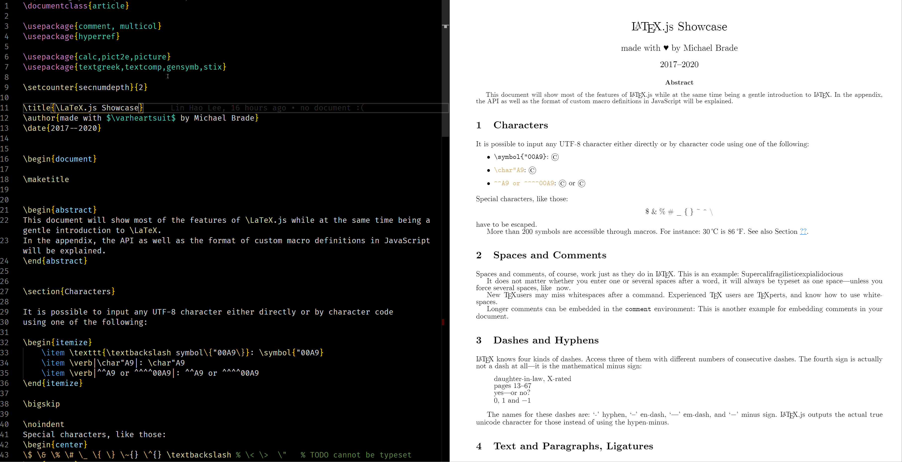

# VSCode LaTeX.js Preview

Provides [LaTeX.js](https://latex.js.org) preview and compilation in VSCode.

> Showcase document by Michael Brade

## Requirements
* [VSCode](https://code.visualstudio.com/) (>= 1.32.0)
* An internet connection: To pull the [most current LaTeX.js package](https://cdn.jsdelivr.net/npm/latex.js/dist/)
* _Optional but recommended_: [LaTeX Workshop](https://marketplace.visualstudio.com/items?itemName=James-Yu.latex-workshop)
  * Provides syntax highlighting, autocomplete, colorise and more.
  * :exclamation: *IMPORTANT* :exclamation:: Please turn off compilation features in LaTeX Workshop to not let it interfere with this extension.
  
  
## Usage Guide
* Install this extension
* Open any valid LaTeX.js-supported file
* Open the command palette (Windows: `Ctrl+Shift+P`, Mac: `Cmd+Shift+P`) 
* Run the `LaTeX.js: Open Preview` or `LaTeX.js: Open Preview to The Side` command.

## Extension Controls, Commands and Settings
* [Commands](docs/COMMANDS.md)
* [Settings](docs/SETTINGS.md)

## Limitations 
* Does not support `CustomMacros` or `languagePatterns` in [LaTeX.js HtmlGenerator options](https://latex.js.org/api.html#class-htmlgenerator).

## Notes
* [LaTeX.js](https://latex.js) requires a DOM to function--VSCode on Electron does not have a DOM, so rendering is done inside the webview (that contains a DOM). There are ways to get around this (such as [jsdom](https://github.com/jsdom/jsdom)), but it is not that straightforward.
* Compilation requires passing the generated HTML from the webview to the extension, I will look into this if there is demand.
* There can be an option for selecting the LaTeX.js version wanted, I will add this feature if there exists a need.

## Contributing
* File bugs and/or feature requests in the [GitHub repository](https://github.com/lhl2617/LaTeX.js)
* Pull requests are welcome in the [GitHub repository](https://github.com/lhl2617/LaTeX.js)
* Buy me a Coffee ☕️ via [PayPal](https://paypal.me/lhl2617)

